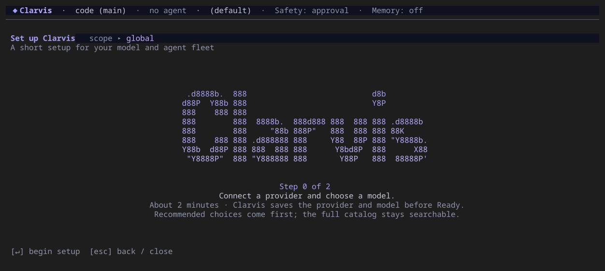

# Clarvis

[](https://github.com/getclarvis/clarvis-releases/releases)
[](https://github.com/getclarvis/clarvis/actions/workflows/ci.yml)
[](LICENSE)

Clarvis is a local-first coding agent that brings models, tools, plans, memory, and multi-agent
workflows into one terminal interface. Start it inside a project, choose a model, and work with the
repository in front of you.

> **Beta:** Clarvis is a pre-1.0 release. Interfaces and pre-1.0 state formats may change, and
> the portable artifacts are not yet code-signed or notarized. Clarvis can read and change files and
> run commands; review approval prompts and use source control.



## Why Clarvis

- **One project-aware TUI:** sessions, transcript, plans, memory, tasks, and run activity stay in one
  discoverable interface.
- **Bring your model:** configure API providers, OpenAI-compatible local endpoints, or the beta
  ChatGPT and Grok subscription flows for eligible accounts. Availability is provider-controlled and
  does not imply provider endorsement of Clarvis.
- **Agent workflows:** use a built-in Lead, delegate to focused Sub-agents, or run the packaged
  `audit`, `implement`, and `research` workflows.
- **Controlled tool use:** path-based workspace confinement, independent command review, native
  sandboxing on Linux and macOS, lazy Docker isolation, and explicit workspace trust are separate
  safeguards.
- **Extensible:** add MCP servers, plugins, hooks, Agent Skills, custom agents, and workflows.
- **Interactive or headless:** use the full TUI or run a prompt from scripts with `clarvis -p`.

## Install the beta

Portable releases include the exact Bun runtime and native OpenTUI dependencies. **Users do not
need Bun, Node.js, a compiler, a package manager, administrator access, or a source checkout.**

Linux (glibc) and macOS:

```bash
curl -fsSL https://github.com/getclarvis/clarvis-releases/releases/latest/download/install.sh | sh
```

Windows PowerShell:

```powershell
irm https://github.com/getclarvis/clarvis-releases/releases/latest/download/install.ps1 | iex
```

Prefer to inspect an installer before running it? The [installation guide](https://clarvis.dev/installation)
keeps the download, review, and execute flow as an alternative.

Verify the command:

```bash
clarvis --version
```

The installers download a versioned archive from GitHub Releases, verify its SHA-256 checksum,
confirm that the staged CLI reports the requested version, and activate it only after every check
succeeds. On Linux or macOS, follow the printed instruction if the resolved launcher directory
(`${CLARVIS_BIN_DIR:-${XDG_BIN_HOME:-$HOME/.local/bin}}`) is not already on `PATH`. Windows adds the
managed launcher to the user `PATH`; an existing terminal may need to be reopened.

The release workflow is configured for glibc-based Linux, macOS, and Windows on x64 and arm64. The
beta Linux archives do not target Alpine or other musl-only distributions. Platform claims remain
beta-level until the corresponding native release job has completed. See
[Installation](https://clarvis.dev/installation) for prerequisites, manual verification, configured targets,
unsigned-binary warnings, PATH behavior, and removal.

## First run

Run Clarvis from the project you want it to work on:

```bash
cd /path/to/your/project
clarvis
```

On a clean installation:

1. Press `Enter` to start the short setup.
2. Connect a provider or local OpenAI-compatible endpoint and select a model.
3. Enter the requested credential when the provider requires one. Clarvis stores credentials in
   the global user configuration, not in the project.
4. Describe the work in the composer. Clarvis starts with the built-in `marshall` Lead and an
   approval-oriented safety profile.

The current directory is the workspace boundary. Global configuration defaults to `~/.clarvis`;
project-specific configuration lives in `<project>/.clarvis`.

Essential controls:

| Input     | Action                                                                   |
| --------- | ------------------------------------------------------------------------ |
| `/help`   | Open the complete, context-aware help screen                             |
| `Esc`     | Clear the current input, close a layer, or return to the previous screen |
| `Ctrl+C`  | Cancel active work; when idle, enter the quit flow                       |
| `/doctor` | Inspect configuration, dependencies, and recoverable setup problems      |
| `/model`  | Choose the default model                                                 |
| `/effort` | Choose the default reasoning effort supported by that model              |
| `Ctrl+S`  | Choose Host, native Sandbox, or Docker isolation                         |
| `Ctrl+G`  | Choose Off, Approval, or automatic LLM command review                    |

Other shortcuts depend on the terminal keyboard profile and appear in the footer and `/help`; the
README does not duplicate a keymap that the application generates dynamically.

Isolation and command review are independent. Docker starts only when the first run needs it; the
simple TUI choice uses product-owned limits, ordinary outbound networking, and automatic fallback
to a required native Sandbox when Docker cannot start operationally. Image-integrity, policy,
recipe, and guest-handshake failures remain fail-closed. Docker Desktop and Colima satisfy the same
Docker Engine contract on macOS; advanced `settings.json` configuration may instead select Podman.

An isolated container mounts the already-selected workspace read-write at `/workspace`, so guest
changes appear on the host immediately. Start Clarvis in a Git worktree when you want that mount to
be a separate checkout; Clarvis does not commit, merge, or remove it. The guest has no engine socket,
and Clarvis-owned workspace control paths are overlaid read-only, but ordinary project files remain
writable. Agents with command access can install missing toolchains through `mise`; Docker retains
that tool cache for the same workspace and image across sessions. Guest services are not broadly
published: the `expose_port` tool creates a bounded loopback-only host URL when requested.

## Common commands

```bash
clarvis                                  # interactive TUI in the current directory
clarvis --continue                       # resume this workspace's latest session
clarvis --list                           # list saved sessions
clarvis -p "explain this repository"     # headless text response
clarvis -p "review this change" --format md
clarvis --worktree                       # create a generated dedicated Git worktree
clarvis --worktree focused-fix           # create or reopen a named worktree
clarvis --ascii                          # use ASCII glyphs
clarvis --update                         # update a managed portable installation
clarvis --help                           # complete CLI reference
```

Self-update remains explicit. After the interactive application has painted, a managed portable
installation checks at most once per day for an eligible release and shows an in-app notice without
downloading or installing it. Disable that global check under **Settings > Updates**. Headless
commands, source checkouts, `bun link`, and unmanaged installations make no automatic release
request. A prerelease follows newer prereleases and the later stable promotion, while a stable
installation ignores prereleases; `clarvis --update` always performs a fresh verified update.

See the [public user guide](https://clarvis.dev/guide/daily-use) for sessions, headless mode,
worktrees, configuration, extensions, data locations, and diagnostics. See
[Terminal compatibility](https://clarvis.dev/terminal-compatibility) for Unicode, color, keyboard profiles,
remote terminals, and current accessibility limits.

## Security model

Clarvis is local-first, but it is not an offline application and neither its native nor container
isolation is a complete security boundary:

- prompts and selected context are sent to the model provider you configure;
- enabled MCP servers, plugins, hooks, task providers, and commands have their own trust boundaries;
- file tools reject paths outside the workspace by default, but this path-based check is not a strong
  write sandbox against a concurrent symlink or junction swap; host execution and user-approved
  operations can also reach beyond a sandboxed process;
- Docker isolation leaves the selected workspace writable and enables ordinary outbound networking
  by default. A guest can therefore modify that checkout and transmit readable workspace content or
  reach host/LAN services; use `network: "none"` when the run must be offline;
- Docker keeps model credentials, host skill paths, Plans, and Memory stores behind narrow host
  bridges, but anything deliberately committed or copied into the mounted workspace is guest-readable;
- credentials saved through the managed API-key and subscription flows stay in global files. POSIX
  installs apply owner-only mode bits; Windows relies on the user's profile access controls. Literal
  provider or MCP headers can be authored in workspace settings, so use `${NAME}` references and
  never place a secret there;
- the model catalog, marketplace, subscription login, and updater may make explicit network
  requests.

Read the [public security overview](https://clarvis.dev/operations/security) before using Clarvis on
sensitive code. Report vulnerabilities privately according to [SECURITY.md](SECURITY.md); do not
open a public issue for a suspected vulnerability.

## Documentation and support

The public, task-oriented documentation lives at [clarvis.dev](https://clarvis.dev). English is
served from the site root, and the complete Brazilian Portuguese edition is available at
[`/pt-BR/`](https://clarvis.dev/pt-BR/).

| Need                                  | Start here                                                                                               |
| ------------------------------------- | -------------------------------------------------------------------------------------------------------- |
| Browse the public product guide       | [clarvis.dev](https://clarvis.dev)                                                                       |
| Install, update, verify, or remove    | [Installation](https://clarvis.dev/installation)                                                         |
| Learn the TUI and CLI                 | [Public user guide](https://clarvis.dev/guide/daily-use)                                                 |
| Terminal or accessibility behavior    | [Terminal compatibility](https://clarvis.dev/terminal-compatibility)                                     |
| Diagnose a problem                    | [Troubleshooting](https://clarvis.dev/operations/troubleshooting) or [Support](SUPPORT.md)               |
| Understand Clarvis                    | [How Clarvis works](https://clarvis.dev/explanation/how-clarvis-works)                                   |
| Contribute code                       | [Contributing](CONTRIBUTING.md) and [AGENTS.md](AGENTS.md)                                               |
| Contribute public documentation       | [`getclarvis/docs`](https://github.com/getclarvis/docs)                                                  |
| Inspect exact behavior and invariants | [Specification index](specs/README.md)                                                                   |
| Follow releases                       | [Changelog](CHANGELOG.md) and [GitHub Releases](https://github.com/getclarvis/clarvis-releases/releases) |

## Contributing

The commands below are **for contributors working from a source checkout**, not for people who
installed a portable release. Development uses Bun exactly `1.4.0`, pinned by `mise.toml`.

Start with [CONTRIBUTING.md](CONTRIBUTING.md). It covers the clone/bootstrap flow, targeted checks,
the documentation contract, TUI validation in a real PTY, and pull-request expectations. Human and
AI contributors should also read [AGENTS.md](AGENTS.md) before editing the monorepo.

The public site source and its deployment workflow are owned by the separate
[`getclarvis/docs`](https://github.com/getclarvis/docs) repository. This monorepo owns product
implementation, package READMEs, specifications, release tooling, and contributor documentation; it
does not build or deploy GitHub Pages.

To install a source-only command from this checkout after Bun is available, run:

```bash
./dev-install.sh
```

That one-time machine setup installs dependencies, configures the repository hook, and creates
`clarvis-develop` in `${CLARVIS_DEV_BIN_DIR:-${XDG_BIN_HOME:-$HOME/.local/bin}}`. Run the command
from any project to test the current checkout without building or downloading a release. Use
`clarvis-develop --empty-workspace` to open every test in a new directory under
`/tmp/clarvis-development-temp/`. `clarvis-develop --clear` removes the effective global state and
all managed temporary workspaces and exits; workspace-local `.clarvis` data outside that temporary
root is not removed. Combine both flags to clear first and then open a newly allocated workspace.

To install a published source RC together with its Docker image, use `./dev-install.sh --candidate`
or `./dev-install.sh --candidate <rc-tag>`. This selects an isolated checkout and requires Git,
the RC's pinned Bun version, and Docker. See the
[Code candidate installation guide](packages/code/README.md) for prerequisites and lifecycle.

## Packages

Clarvis is one product made from 18 private, unversioned workspace packages. They are implementation
units and are not published independently.

| Package                                        | Role                | Path                   | Description                                                  |
| ---------------------------------------------- | ------------------- | ---------------------- | ------------------------------------------------------------ |
| [`@clarvis/capability`](packages/capability)   | foundation          | `packages/capability`  | Cross-cutting capability and port contracts.                 |
| [`@clarvis/paths`](packages/paths)             | foundation          | `packages/paths`       | Global, workspace, and generated-state directory vocabulary. |
| [`@clarvis/protocol`](packages/protocol)       | host contract       | `packages/protocol`    | Transport-neutral Kernel client contract.                    |
| [`@clarvis/llm`](packages/llm)                 | execution service   | `packages/llm`         | Provider layer behind the `LLMProvider` port.                |
| [`@clarvis/mcp-client`](packages/mcp-client)   | execution service   | `packages/mcp-client`  | MCP transports, connections, and pooling.                    |
| [`@clarvis/supervision`](packages/supervision) | execution service   | `packages/supervision` | Run-scoped parent/child observation and control.             |
| [`@clarvis/trace`](packages/trace)             | execution service   | `packages/trace`       | Run trace recording, persistence, and wire projection.       |
| [`@clarvis/tools`](packages/tools)             | execution service   | `packages/tools`       | Coding, filesystem, shell, and monitor tools.                |
| [`@clarvis/hooks`](packages/hooks)             | execution service   | `packages/hooks`       | Operator-declared workspace hook execution.                  |
| [`@clarvis/skills`](packages/skills)           | execution service   | `packages/skills`      | `SKILL.md` discovery and progressive loading.                |
| [`@clarvis/loop`](packages/loop)               | engine              | `packages/loop`        | Embeddable agent-loop engine.                                |
| [`@clarvis/memory`](packages/memory)           | product capability  | `packages/memory`      | Markdown memory wiki, search, and indexing.                  |
| [`@clarvis/plan`](packages/plan)               | product capability  | `packages/plan`        | Provider-neutral plans and review gates.                     |
| [`@clarvis/tasks`](packages/tasks)             | product capability  | `packages/tasks`       | External task-management adapters and tools.                 |
| [`@clarvis/workflows`](packages/workflows)     | product capability  | `packages/workflows`   | Multi-agent workflow scheduling and records.                 |
| [`@clarvis/kernel`](packages/kernel)           | host implementation | `packages/kernel`      | Composition root and isolated-runtime model/MCP authority.   |
| [`@clarvis/code`](packages/code)               | application         | `packages/code`        | The `clarvis` terminal UI, including conversation prompt scheduling. |
| [`@clarvis/server`](packages/server)           | application         | `packages/server`      | Authenticated MCP-over-HTTP facade, currently source-only.   |

The [architecture overview](https://clarvis.dev/explanation/how-clarvis-works) explains the product
model. The generated
[package coupling report](specs/package-coupling-analysis.md) is the exact graph authority.
The kernel's [prompt-cache composition tests](specs/cross-cutting/prompt-cache.md) additionally
use `@clarvis/llm` as a development dependency; this does not change the runtime graph.

## License

Clarvis is available under the [MIT License](LICENSE). Portable archives also contain the applicable
third-party notices and license texts described in [THIRD_PARTY_NOTICES.md](THIRD_PARTY_NOTICES.md).
