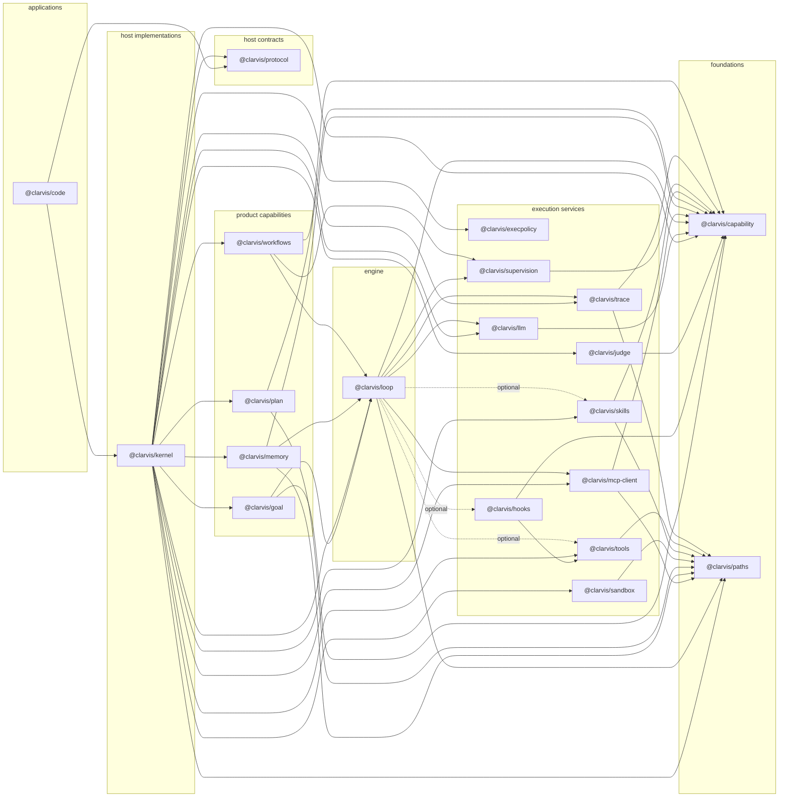

# Package coupling analysis

Generated companion to `tooling/checks/package-graph.ts`. The marked block below is the verbatim
output of that script's `renderMarkdown`, and `checkDocument` compares the complete fragment against
the graph derived from manifests and source. It includes each package's semantic role, direct
internal dependencies, optional edges, internal consumers, and a role-grouped diagram.

That makes this document a **build input, not prose**. `bun run check:graph` — the tail of
`lint:intent`, which is a phase of `check:pre-commit` — reads it with a bare `readFileSync`, so a
missing or stale file fails the gate deterministically, regardless of the change being committed.

## Regenerating

```bash
bun run tooling/checks/package-graph.ts > /tmp/graph.md   # prints exactly the generated block
bun run check:graph                                       # re-validates this file against the graph
```

Update the marked block whenever a package gains or loses an internal dependency or changes role.
The table and Mermaid source belong to the generator and must stay exactly as emitted.

## The graph

<!-- prettier-ignore-start -->
<!-- package-graph:start -->
Packages: 20; internal edges: 50; optional edges: 3.

| Package | Role | Direct internal dependencies | Internal consumers |
| --- | --- | --- | ---: |
| `capability` | foundation | — | 13 |
| `code` | application | `kernel`, `protocol` | 0 |
| `execpolicy` | execution-service | — | 1 |
| `goal` | product-capability | `capability`, `loop` | 1 |
| `hooks` | execution-service | `capability`, `tools` | 1 |
| `judge` | execution-service | `capability` | 1 |
| `kernel` | host-implementation | `capability`, `execpolicy`, `goal`, `judge`, `llm`, `loop`, `mcp-client`, `memory`, `paths`, `plan`, `protocol`, `sandbox`, `skills`, `tools`, `trace`, `workflows` | 1 |
| `llm` | execution-service | `capability` | 2 |
| `loop` | engine | `capability`, `hooks` (optional), `llm`, `mcp-client`, `paths`, `skills` (optional), `supervision`, `tools` (optional), `trace` | 4 |
| `mcp-client` | execution-service | `capability`, `paths` | 2 |
| `memory` | product-capability | `capability`, `loop`, `paths` | 1 |
| `paths` | foundation | — | 9 |
| `plan` | product-capability | `capability`, `paths` | 1 |
| `protocol` | host-contract | — | 2 |
| `sandbox` | execution-service | `paths` | 1 |
| `skills` | execution-service | `capability`, `paths` | 2 |
| `supervision` | execution-service | `capability` | 2 |
| `tools` | execution-service | `paths` | 3 |
| `trace` | execution-service | `capability`, `paths` | 2 |
| `workflows` | product-capability | `capability`, `loop`, `supervision` | 1 |

### Direct graph grouped by role

Arrows point from consumer to dependency; a dotted arrow is optional.


<!-- package-graph:end -->
<!-- prettier-ignore-end -->

## Reading the graph

- **Direct internal dependencies** lists `@clarvis/*` entries in the package's `dependencies` plus
  `optionalDependencies`; optional entries are labeled explicitly. `loop` is the only package that
  declares optional internal dependencies.
- **Internal consumers** counts the workspace packages that depend on the row's package.
- **Role** comes from the central registry in `tooling/lib/package-architecture.ts`; `check:graph`
  rejects packages without one and dependencies that violate the role policy.
- A leaf with zero dependencies and many consumers (`capability` at 13, `paths` at 10) is a
  vocabulary package: everything above it is allowed to name it, and it may name nothing.
- A package with zero consumers (`code`) is an application: it is the top of the graph and
  nothing in the workspace may depend on it.
